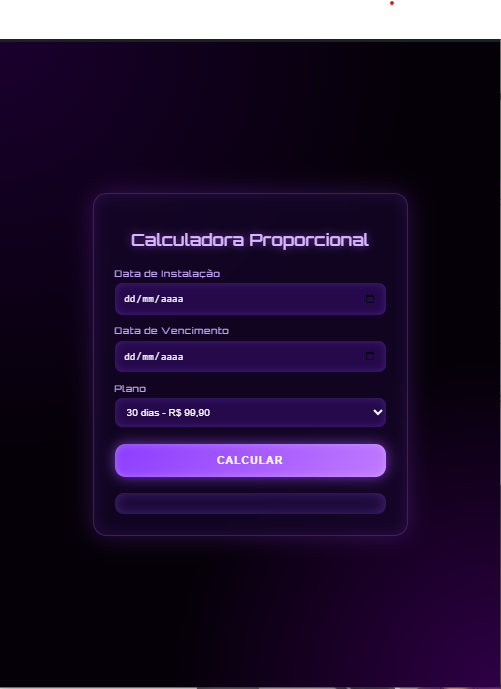

# 🌐 xnet.git.io  
## 📱 Calculadora Proporcional de Planos (PWA)

   
  Interface futurista em tons de roxo — rápida, responsiva e profissional

---

### ✨ Visão Geral

A **Calculadora Proporcional de Planos** é uma **Progressive Web App (PWA)** desenvolvida para calcular valores proporcionais de planos mensais de forma **automática, precisa e intuitiva**.

Projetada especialmente para **provedores de internet, empresas de serviços recorrentes e equipes comerciais**, a aplicação elimina cálculos manuais, reduz erros e agiliza o atendimento ao cliente.

---

### 🚀 Principais Funcionalidades

✔️ Cálculo proporcional automático baseado nos dias utilizados  
✔️ Suporte a múltiplos planos mensais (30 dias)  
✔️ Interface moderna com design futurista (Glassmorphism)  
✔️ Totalmente responsiva (mobile, tablet e desktop)  
✔️ Funciona offline (Service Worker)  
✔️ Instalação como aplicativo nativo (PWA)

---

### 🖼️ Interface

- Design focado em **usabilidade**
- Estética futurista em **tons de roxo**
- Campos claros e fluxo simples
- Ideal para uso rápido em atendimento comercial

---

### 🛠️ Tecnologias Utilizadas

- **HTML5**
- **CSS3** (Glassmorphism / UI futurista)
- **JavaScript Vanilla**
- **Progressive Web App (PWA)**
- **Service Worker**
- **Web Manifest**

---

### 📲 Instalação como App (PWA)

1. Hospede o projeto em um servidor **HTTPS**
2. Acesse pelo navegador (Chrome, Edge ou similares)
3. Clique em **“Adicionar à tela inicial”**
4. Utilize como um aplicativo nativo, inclusive **offline**

---

### 🎯 Objetivo do Projeto

Fornecer uma solução **simples, leve e profissional** para cálculo proporcional de cobranças, com foco em:

- Experiência do usuário
- Design moderno
- Portabilidade
- Uso comercial real

Este projeto também faz parte do **portfólio de desenvolvimento web/PWA**, demonstrando boas práticas de UI, lógica de negócio e performance.

---

### 📄 Licença

Este projeto é de uso livre para fins educacionais e comerciais internos.  
Sinta-se à vontade para adaptar conforme sua necessidade.
